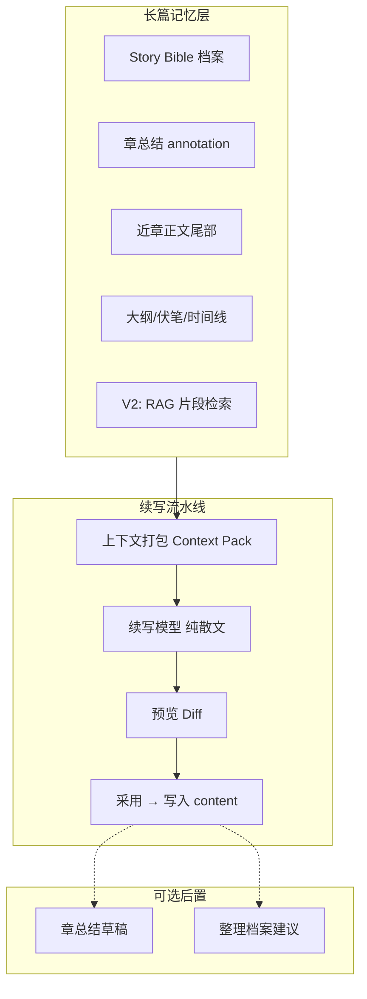
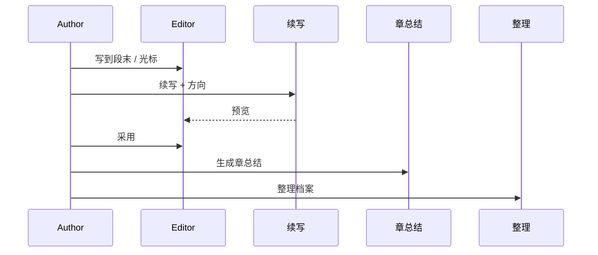

# AI 续写功能设计方案（长篇向）

## 1. 背景与目标

### 1.1 问题

长篇小说无法把全书正文一次性塞进模型。当前产品已有：

- **章总结**（`summarizeNovelChapterFromWorkspaceStream` → `chapter.annotation`）
- **档案整理**（实体/关系/伏笔/分类，人机「采用/忽略」）
- **AI 阅读台**（问答 + 有限工具，偏分析与改档案）

缺少的是：**在正文编辑器里、基于长篇记忆、可控地续写下一节 prose**，且续写结果需作者确认后再写入，避免污染正文。

### 1.2 目标（V1）

| 目标 | 说明 |
|------|------|
| **章内续写** | 在当前章光标处或章末，流式生成下一段正文 |
| **长篇连贯** | 自动打包「当前章尾部 + 近章摘要 + 档案 + 大纲」，在 token 预算内尽量保持一致性 |
| **人机协同** | 预览 → **采用**（插入正文）/ **忽略** / **重新生成**，与「整理」同一心智 |
| **计费一致** | 走现有 `POST /ai/chat` 流式与钱包扣费 |

### 1.3 非目标（V1 不做）

- 全自动「后台连写 N 章」自动驾驶模式
- 云端作品同步、多设备协同
- 向量库/RAG 全量上线（列为 V2）
- 续写时自动改档案（续写后可选触发「整理」，但不默认写入）

---

## 2. 产品概念：续写 ≠ 聊天 ≠ 整理



| 能力 | 输出 | 是否直接改正文/档案 |
|------|------|---------------------|
| **续写** | 散文段落 | 仅「采用」后改 `chapter.content` |
| **整理** | JSON 建议 | 仅「采用」后改档案 |
| **章总结** | 总结散文 | 作者保存后改 `annotation` |
| **阅读台** | 对话/工具 | 视工具而定 |

---

## 3. 用户流程（V1）

### 3.1 入口

1. **正文编辑区工具条**：`AI 续写`（主入口）
2. **AI 侧栏**（可选）：与「整理」并列的「续写」标签，共享钱包与登录态

### 3.2 续写前配置（轻量弹层）

| 字段 | 默认 | 说明 |
|------|------|------|
| **续写位置** | 光标处 / 章末 | 决定插入点 |
| **大致字数** | 800 / 1500 / 3000 | 软约束，写入 user prompt |
| **方向提示**（可选） | 空 | 如「两人争吵后陈平安独自离开」 |
| **参考范围** | 当前章 + 前 2 章摘要 | V1 固定策略，高级选项后置 |

### 3.3 生成与确认

1. 侧栏或底部 **流式预览** 续写稿（非直接写入编辑器）
2. 按钮：**采用** | **忽略** | **重新生成** | **停止**
3. **采用**：
   - 光标处：在 `selectionStart` 插入（前后自动补换行规则见 §6）
   - 章末：追加到 `content` 末尾
4. 可选勾选：**采用后更新章总结草稿**（调用现有章总结流，不自动保存）
5. 可选勾选：**采用后整理本章档案**（调用现有整理，保持采用/忽略）

---

## 4. 长篇记忆：上下文打包（核心）

### 4.1 分层与优先级（预算内从低到高裁剪）

预算建议：按模型上下文 **留 40% 给输出**，**60% 给输入**；输入侧再分块（字符估算即可，V1 用 `charBudget` 常量）。

| 优先级 | 块 ID | 内容 | 典型上限 |
|--------|--------|------|----------|
| P0 | `anchor` | 续写锚点：光标前 1.5k～3k 字 **或** 章末 2k 字 | 必须保留 |
| P0 | `instruction` | 作者方向 + 字数 + 作品 tone/perspective | 必须保留 |
| P1 | `chapter_meta` | 当前章 title、notes、已有 annotation 总结 | 短 |
| P2 | `prev_tail` | 上一章 **末尾** 800～1200 字（衔接语气） | 中 |
| P3 | `prev_summaries` | 前 1～5 章 `annotation`（无则退化为 excerpt 前 400 字） | 中 |
| P4 | `bible_compact` | 本章出场人物 + 相关关系 + 活跃伏笔标题列表 | 中 |
| P5 | `outline_slice` | 绑定当前章/下一节拍的大纲项（goal/conflict/result） | 短 |
| P6 | `novel_brief` | 作品 summary、genre、tone | 短 |
| V2 | `rag_snippets` | 按人物/地点从旧章检索的原文片段 | 可变 |

**裁剪顺序**：先删 P6→P5→…，**永不删 P0**。

### 4.2 与现有代码的关系

复用并扩展 `frontend/src/lib/localAi.ts`：

- 已有 `buildExtractContext`、`buildNearbyChapterContext`（excerpt 较短，**续写需单独 `buildContinueContext`**，近章 tail 更长）
- 已有 `summarizeNovelChapterFromWorkspaceStream`、`classifyNovelChapterFromWorkspace`
- 新建 `continueChapterFromWorkspaceStream(payload, input, callbacks)`

`buildNovelWorkspacePayload` 继续作为唯一数据入口（本地作品快照）。

### 4.3 章级「记忆」不新增表（V1）

长篇记忆 **不引入新数据库表**，仅用已有字段：

- `chapter.content` — 近端原文
- `chapter.annotation` — 章总结（压缩记忆）
- `chapter.notes` — 作者意图
- 档案实体 / 大纲 / 伏笔 — Story Bible

**可选 V1.5**：`novel.continuityBrief`（全书滚动摘要，每 N 章作者一键生成并保存），仍存本地 `novel` 对象。

---

## 5. 提示词设计

### 5.1 System（`CONTINUE_SYSTEM_PROMPT`）

要点：

- 角色：**中文小说续写助手**，只输出**正文**，不要 Markdown、不要元评论
- 严格接续 `anchor` 的语气、人称、时态、专有名词
- 禁止复述 anchor 已有句子；禁止编造与档案/总结冲突的设定
- 档案中未出现的人物不得擅自登场（除非 direction 明确要求）
- 字数约 X 字，写完整场景节拍，可停在悬念处

与 `CHAPTER_SUMMARY_SYSTEM_PROMPT` 明确区分：总结助手 **禁止续写**；续写助手 **禁止总结**。

### 5.2 User（`buildContinueUserPrompt`）

结构化文本块（非 JSON，利于模型读）：

```text
【作品】标题 / 类型 / 视角 / 基调
【本章】第 N 章 标题 | 作者备注 | 章总结（若有）
【续写要求】字数 | 方向提示
【锚点正文】（光标前或章末）
【上一章衔接】…
【前情提要】第 N-1 章总结 …
【档案摘录】角色… 关系… 伏笔…
【大纲节拍】…
```

### 5.3 模型参数

| 参数 | 建议 |
|------|------|
| `temperature` | 0.65～0.85（高于整理的 0.1） |
| `stream` | true |
| `response_format` | 无（纯文本） |
| 工具调用 | **关闭**（续写不走 `AI_WRITE_TOOLS`） |

---

## 6. 技术接口

### 6.1 前端 API（`localAi.ts`）

```ts
export type AiContinueMode = 'cursor' | 'end'

export type ContinueChapterInput = {
  chapterId: string
  mode: AiContinueMode
  cursorOffset?: number      // mode=cursor 时必填
  targetChars?: number       // 800 | 1500 | 3000
  direction?: string
  prevSummaryChapterCount?: number  // 默认 3
}

export type ContinueChapterResult = {
  text: string
  contextMeta: {
    usedChars: number
    droppedLayers: string[]  // 被预算裁掉的块
    warnings: string[]
  }
}

continueChapterFromWorkspaceStream(
  payload: WorkspaceSnapshotPayload,
  input: ContinueChapterInput,
  callbacks: { onChunk; onError },
  signal?: AbortSignal,
): Promise<ContinueChapterResult>
```

### 6.2 后端

**无新路由**：继续 `POST /ai/chat`，与章总结相同，由 `AiService` 计费。

### 6.3 写入正文（`NovelChapterHubView` / composable）

```ts
applyContinueDraft({
  chapterId,
  mode,
  cursorOffset,
  text,
}): void
```

规则：

- `end`：`content + (content.endsWith('\n') ? '' : '\n\n') + text`
- `cursor`：在 offset 插入，若前后皆汉字且无标点，不自动加空格（中文无空格）
- 写入后 `updateChapter`，触发已有保存 toast

---

## 7. UI 设计

### 7.1 编辑区工具条

- 按钮 `AI 续写`（需登录 + 余额，与整理一致 `requestAiAccess`）
- 无选中章节时 disabled

### 7.2 续写面板（推荐：编辑器下方抽屉，或 AI 侧栏「续写」Tab）

```
┌─────────────────────────────────────────┐
│ 续写预览                    [停止]      │
│ ─────────────────────────────────────── │
│ （流式正文…）                           │
│ ─────────────────────────────────────── │
│ 参考：已用前 3 章总结 + 12 人档案       │
│ [采用] [忽略] [重新生成]                │
│ ☐ 采用后生成章总结草稿  ☐ 采用后整理    │
└─────────────────────────────────────────┘
```

- **采用/忽略** 文案与整理侧栏统一
- 展示 `contextMeta.warnings`（如「第 5 章无总结，已用正文摘录」）

### 7.3 状态

| 状态 | UI |
|------|-----|
| `idle` | 仅显示配置 |
| `streaming` | 预览区流式 + 停止 |
| `ready` | 启用采用/忽略/重新生成 |
| `applied` | 提示「已写入正文，可 Ctrl+Z」 |

---

## 8. 长篇闭环（推荐工作流）

作者每章循环：

1. **写 / 续写** 正文（本功能）
2. **章总结** → 写入 `annotation`（压缩记忆）
3. **整理** → 档案采用/忽略（结构化记忆）
4. 下一章重复

第 10 章后仍缺细节时，启用 **V2 RAG** 从旧章检索。



---

## 9. 分阶段交付

### Phase 1 — 最小可用（建议 1～2 周）

- [ ] `buildContinueContext` + `CONTINUE_SYSTEM_PROMPT`
- [ ] `continueChapterFromWorkspaceStream`
- [ ] 编辑区「AI 续写」+ 预览抽屉 + 采用/忽略
- [ ] 章末续写 + 光标续写
- [ ] 计费/流式/错误态与章总结对齐

### Phase 2 — 长篇增强

- [ ] 可配置「前情章数」与字数档位
- [ ] `novel.continuityBrief` 全书摘要（可选一键生成）
- [ ] 采用后一键「章总结草稿」「整理本章」
- [ ] 上下文占用可视化（已用/裁剪了哪些层）

### Phase 3 — RAG

- [ ] 章节切片索引（本地 IndexedDB + embedding API 或关键词）
- [ ] 续写前按出场人物名检索 3～5 段 excerpt 注入 P6
- [ ] 与整理共用 evidence 风格引用

---

## 10. 风险与对策

| 风险 | 对策 |
|------|------|
| 上下文超长被截断 | 分层打包 + `droppedLayers` 提示作者补章总结 |
| 人设/称呼漂移 | bible_compact 必带当前场人物；V2 RAG |
| 续写幻觉新设定 | system 禁止；整理不自动跑 |
| 采用后难撤销 | 写入前预览；编辑器支持 Undo |
| 费用过高 | 默认 800 字档；显示预估消耗（沿用钱包） |

---

## 11. 与现有模块对照

| 模块 | 文件 | 续写关系 |
|------|------|----------|
| 上下文快照 | `lib/storage.ts` `buildNovelWorkspacePayload` | 数据源 |
| AI 调用 | `lib/localAi.ts` `lib/backendAi.ts` | 新增 continue* |
| 章总结 | `App.vue` / `summarizeNovelChapterFromWorkspaceStream` | 后续可选联动 |
| 整理 | `ChapterHubAiEntityPanel` `extractNovelEntities*` | 后续可选联动 |
| 阅读台 | `askAiWithToolsStream` | 不混用；续写无 tools |
| 计费 | `backend` `AiService` | 复用 |

---

## 12. 验收标准（Phase 1）

1. 在第 3 章章末续写 1500 字，能接上第 2 章章总结中的人名与冲突。
2. 光标在中间时，续写不重复锚点段落开头。
3. 流式过程中可停止；采用前正文不变。
4. 采用后仅 `content` 变化；档案不变。
5. 未登录/余额不足时与整理一致拦截。

---

## 13. 待决问题（实现前可拍板）

1. **主入口**：仅编辑区工具条，还是 AI 侧栏独立 Tab？
2. **默认字数**：800 还是 1500？
3. **前情默认章数**：2 章总结 + 1 章 tail，还是 5 章仅总结？
4. **是否 V1 就做「全书 continuityBrief」**？

---

*文档版本：2026-05-23 · 对齐当前本地作品 + 后端 `/ai/chat` 架构*
